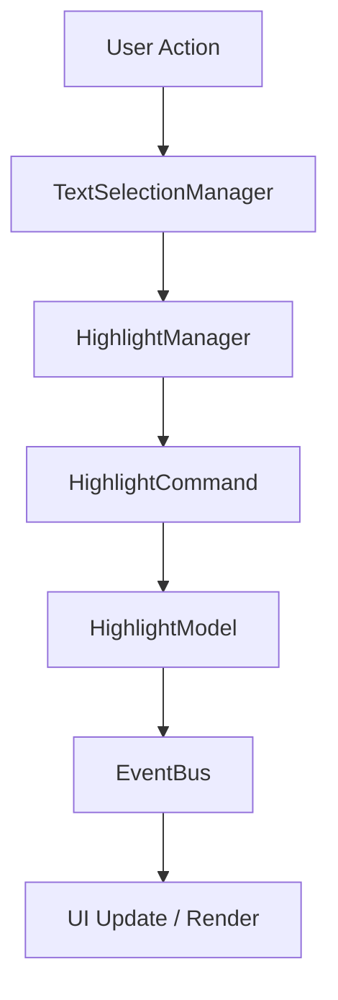

# Highlight System

## Overview

The Highlight System provides comprehensive text highlighting functionality for PDF documents, supporting text selection, highlight creation, editing, persistence, and export.

## Quick Start

### 1. Initialization

```cpp
#include "managers/HighlightManager.h"

// Initialize in MainWindow
auto& manager = HighlightManager::instance();
manager.setUndoStack(m_undoStack);
manager.setAutoSaveEnabled(true);
```

### 2. Setting Document

```cpp
// Set document when opening
manager.setDocument(document, filePath);
```

### 3. Creating Highlights

```cpp
// Create highlight from selection
if (m_textSelectionManager->hasSelection()) {
    TextSelection selection = m_textSelectionManager->getSelection();
    manager.addHighlightFromSelection(selection, pageNumber);
}
```

### 4. Rendering

```cpp
// Render in paintEvent
auto highlights = manager.getHighlightsForPage(pageNumber);
HighlightRenderer::renderHighlights(painter, highlights, scaleFactor);
```

## Core Features

- **Data Model**: Complete highlight data structure with CRUD operations
- **Command Pattern**: Full undo/redo support for all operations
- **Color System**: 7 preset colors + custom color support
- **Persistence**: Automatic JSON saving and loading
- **Export**: Export to Markdown, JSON, and Plain Text
- **Rendering**: High-performance rendering with transparency and scaling support
- **Event System**: Integrated with EventBus for decoupled communication

## Architecture

### Core Components

- **HighlightManager**: Singleton manager coordinating all highlight operations.
- **HighlightModel**: Manages highlight data and provides query interfaces.
- **HighlightCommands**: Implements `QUndoCommand` for all operations.
- **HighlightRenderer**: Static helper for rendering highlights on `QPainter`.
- **HighlightColorManager**: Manages color presets and configurations.

### Data Flow



## API Reference

### HighlightManager

```cpp
// Access singleton
HighlightManager& manager = HighlightManager::instance();

// Document management
manager.setDocument(document, filePath);
manager.onDocumentClosed();

// Operations
manager.addHighlightFromSelection(selection, pageNumber, color, opacity);
manager.removeHighlight(highlightId);
manager.editHighlightNote(highlightId, newNote);
manager.changeHighlightColor(highlightId, newColor);

// Queries
manager.getHighlightsForPage(pageNumber);
manager.searchHighlights(query);
manager.findHighlightAtPoint(pageNumber, point);

// Export
manager.exportToMarkdown();
manager.exportToFile(filePath, format);
```

### HighlightRenderer

```cpp
// Render single highlight
HighlightRenderer::renderHighlight(painter, highlight, scaleFactor);

// Render all highlights for page
HighlightRenderer::renderHighlights(painter, highlights, scaleFactor);
```

## Data Format

Highlights are stored in JSON format:

```json
{
  "version": "1.0",
  "documentPath": "/path/to/document.pdf",
  "highlights": [
    {
      "id": "uuid-string",
      "pageNumber": 0,
      "text": "highlighted text",
      "color": "#FFFF0066",
      "opacity": 0.4,
      "note": "my note",
      "createdTime": "2024-01-17T12:00:00",
      "rects": [
        {"x": 10.0, "y": 20.0, "width": 90.0, "height": 15.0}
      ]
    }
  ]
}
```

## Usage Examples

### Context Menu Integration

```cpp
void PDFViewer::contextMenuEvent(QContextMenuEvent* event) {
    QMenu menu;
    auto& manager = HighlightManager::instance();

    if (hasSelection()) {
        QMenu* highlightMenu = menu.addMenu("Highlight");
        for (auto color : HighlightColorManager::getAllPresets()) {
            highlightMenu->addAction(HighlightColorManager::getColorName(color), [=]() {
                manager.addHighlightFromSelection(selection, page, color);
            });
        }
    }
    menu.exec(event->globalPos());
}
```

### Keyboard Shortcuts

```cpp
// Ctrl+H to highlight
new QShortcut(QKeySequence("Ctrl+H"), this, [=]() {
    if (hasSelection()) manager.addHighlightFromSelection(selection, page);
});
```

## Performance

- **Lazy Loading**: Highlights are loaded only when needed.
- **Spatial Indexing**: Efficient querying by page and geometry.
- **Command Merging**: Reduces memory usage for frequent operations.
- **Auto-Save Debouncing**: Prevents excessive disk I/O.
