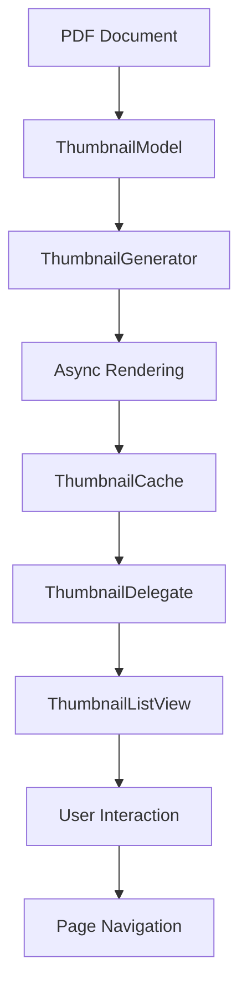

# Thumbnail System Documentation

## Overview

This project implements a high-performance, Chrome-style PDF thumbnail system, providing a smooth user experience and excellent performance.

## Core Features

### 🎨 Chrome-style Design

- Rounded corners and shadow effects
- Hover and selection state animations
- Modern visual design
- Light and dark theme support

### ⚡ High Performance Optimization

- Virtual scrolling based on `QAbstractListModel`
- Intelligent lazy loading mechanism
- Asynchronous thumbnail generation
- Memory usage optimization
- Multi-threaded rendering

### 🔧 Rich Functionality

- Click to jump to page
- Context menu operations
- Keyboard navigation support
- Drag and drop support (optional)
- Cache management

## Architecture Design

### Core Components

```
ThumbnailSystem
├── ThumbnailWidget          # Individual thumbnail widget
├── ThumbnailModel          # Data model (virtual scrolling)
├── ThumbnailDelegate       # Rendering delegate
├── ThumbnailGenerator      # Asynchronous generator
├── ThumbnailListView       # List view container
├── ThumbnailContextMenu    # Context menu
├── ThumbnailAnimations     # Animation management
├── ThumbnailVirtualizer    # Virtual scrolling optimization
├── ThumbnailCacheAdapter   # Cache adapter
└── ThumbnailPerformanceOptimizer # Performance optimizer
```

### Data Flow



## Usage

### Basic Integration

```cpp
// 1. Create components
auto thumbnailModel = std::make_unique<ThumbnailModel>(this);
auto thumbnailDelegate = std::make_unique<ThumbnailDelegate>(this);
auto thumbnailView = new ThumbnailListView(this);

// 2. Set up associations
thumbnailView->setThumbnailModel(thumbnailModel.get());
thumbnailView->setThumbnailDelegate(thumbnailDelegate.get());

// 3. Configure document
std::shared_ptr<Poppler::Document> document = loadPDFDocument(filePath);
thumbnailModel->setDocument(document);

// 4. Connect signals
connect(thumbnailView, &ThumbnailListView::pageClicked,
        this, &MainWindow::onThumbnailPageClicked);
```

### Advanced Configuration

```cpp
// Set thumbnail size
QSize thumbnailSize(150, 200);
thumbnailView->setThumbnailSize(thumbnailSize);
thumbnailModel->setThumbnailSize(thumbnailSize);
thumbnailDelegate->setThumbnailSize(thumbnailSize);

// Configure performance parameters
thumbnailModel->setCacheSize(200);           // Cache 200 thumbnails
thumbnailModel->setMemoryLimit(512 * 1024 * 1024); // 512MB memory limit
thumbnailModel->setPreloadRange(5);          // Preload 5 pages

// Configure generator
auto generator = thumbnailModel->getGenerator();
generator->setMaxConcurrentJobs(4);          // 4 concurrent jobs
generator->setQuality(1.2);                  // 120% quality
```

### Custom Styling

```cpp
// Set theme
thumbnailDelegate->setLightTheme();  // Light theme
// or
thumbnailDelegate->setDarkTheme();   // Dark theme

// Custom colors
QColor background = QColor(255, 255, 255);
QColor border = QColor(200, 200, 200);
QColor text = QColor(60, 60, 60);
QColor accent = QColor(66, 133, 244);
thumbnailDelegate->setCustomColors(background, border, text, accent);
```

## Performance Optimization Tips

### Memory Management

- Set reasonable cache sizes to avoid memory overflows
- Use memory limits to automatically manage cache
- Periodically clear unnecessary cache items

### Rendering Optimization

- Adjust thumbnail quality based on display needs
- Use preloading to improve user experience
- Limit the number of concurrent rendering tasks

### User Experience

- Enable animations for better visual experience
- Use lazy loading to avoid UI freezing
- Provide loading indicators and error prompts

## Troubleshooting

### Common Issues

**Q: Thumbnails show as blank**
A: Check if the PDF document is correctly loaded and verify Poppler library version compatibility.

**Q: High memory usage**
A: Adjust cache size and memory limits, enable automatic memory management.

**Q: Slow loading speed**
A: Increase concurrent task count, adjust preload range, check disk I/O performance.

**Q: Choppy animations**
A: Check system performance, consider disabling some animation effects.

### Debugging Info

Enable debug output:

```cpp
// Add in main function
QLoggingCategory::setFilterRules("thumbnail.*=true");
```

View performance statistics:

```cpp
// Get cache statistics
int hits = thumbnailModel->cacheHitCount();
int misses = thumbnailModel->cacheMissCount();
qint64 memory = thumbnailModel->currentMemoryUsage();

qDebug() << "Cache hits:" << hits << "misses:" << misses
         << "memory:" << memory / 1024 / 1024 << "MB";
```

## API Reference

### ThumbnailModel

The main data model class, responsible for managing thumbnail data and caching.

**Key Methods:**

- `setDocument()` - Set PDF document
- `setThumbnailSize()` - Set thumbnail size
- `setCacheSize()` - Set cache size
- `requestThumbnail()` - Request thumbnail generation

### ThumbnailListView

The main view component, providing the user interaction interface.

**Key Methods:**

- `setThumbnailModel()` - Set data model
- `scrollToPage()` - Scroll to specific page
- `setCurrentPage()` - Set current page

### ThumbnailDelegate

Rendering delegate, responsible for thumbnail visual effects.

**Key Methods:**

- `setThumbnailSize()` - Set rendering size
- `setLightTheme()` / `setDarkTheme()` - Set theme
- `setAnimationEnabled()` - Enable/disable animations

## Extension Development

### Adding Custom Actions

```cpp
// Create custom context menu action
QAction* customAction = new QAction("Custom Action", this);
connect(customAction, &QAction::triggered, [this]() {
    // Custom logic
});

// Add to context menu
thumbnailView->addContextMenuAction(customAction);
```

### Custom Rendering Effects

```cpp
// Inherit from ThumbnailDelegate to implement custom rendering
class CustomThumbnailDelegate : public ThumbnailDelegate {
protected:
    void paint(QPainter* painter, const QStyleOptionViewItem& option,
               const QModelIndex& index) const override {
        // Custom drawing logic
        ThumbnailDelegate::paint(painter, option, index);

        // Add extra effects
        // ...
    }
};
```

## Version History

- **v1.0.0** - Initial version, basic thumbnail functionality
- **v1.1.0** - Added Chrome-style design and animation effects
- **v1.2.0** - Performance optimization and virtual scrolling
- **v1.3.0** - Context menu and interaction features

## License

This thumbnail system follows the project's overall license agreement.
